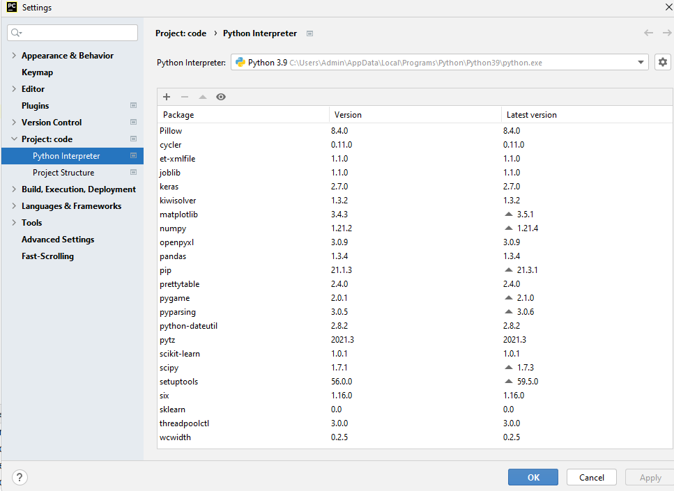

 - Những file có thể chạy riêng
    + main.py (bao gồm gần như bài  1 trong đề thi)
      + đã bao gồm kpdl.py bên trong
      + đã bao gồm bin.py bên trong
    + k-means.py
      + file đầu vào: kmeans_data.txt
    + bin.py (làm trơn thùng)
      + nếu chạy riêng file này thì bỏ  comment  đoạn code tham số bên dưới để tùy chỉnh tham số
    + tuong_quan.py (tương quan giữa 2 dãy)
    + Chuẩn hóa (4 loại chuẩn hóa)
      + zscore: đã trong main.py
      + min_max_normalize.py file riêng
      + độ trung bình tuyệt đối do_tb_tuyet_doi_normalize.py file riêng (đã thêm)
      + decimalScaling: decimal_scaling.py (đã thêm) (không chép, dùng đối chiếu)
 - Ngoài ra có thể xem thêm các ảnh cách trình bày trong thư mục img cho đầy đủ

 - Để chạy được code
   - file (góc trên trái pycharm)-> setting -> project:Code -> python interpreter
   - 
   - ấn dấu + để thêm các thư viện
     - numpy
     - prettytable
     - matplotlib